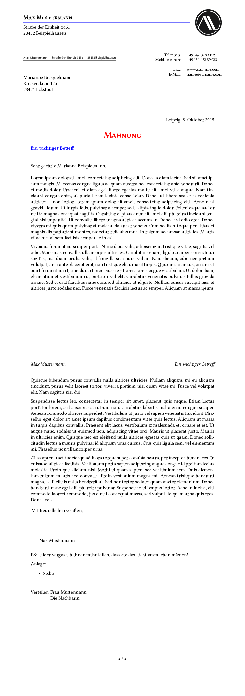

# DIN-Brief Template

A DIN letter template for pdf- or XeLaTeX.

## Install

`make install`

## Default Address/Options

- take a copy of the provided example letter-class-options: `cp example.lco ${USERNAME}.lco`
- change it to your needs

## Use it

- `message.tex` provides a working exmaple
- or derive from this (change these values `<...>`):

```tex
\documentclass[version=last, fontsize=12pt]{scrlttr2}

\usepackage{letterAlinz}

\begin{document}

\LoadLetterOptions{letterStyleAlinz, <MyLCO>}
% change <myLCO> to the name of your letter-class-option file, \wo the `.lco` ending

\setkomavar{yourref}{}
\setkomavar{yourmail}{}
\setkomavar{myref}{}
\setkomavar{customer}{}
\setkomavar{invoice}{}
\setkomavar{place}{<MyCity>}
\setkomavar{date}{\today}

\setkomavar{title}{Ein schoener langer Titel}
\addtokomafont{title}{\scshape\color{red}}

\setkomavar{subject}{Ein wichtiger Betreff}
\begin{letter}[%
%    subject=untitled,% underlined, centered, right, afteropening
    headsepline=true,%
    footsepline=false,%
    fromlogo%
]{%
    Marianne Beispielmann\\
    Kreisverkehr 12a\\
    23421 Eckstadt%
}

\opening{Sehr geehrte \usekomavar{toname},}

hier können Sie nach belieben schwafeln.

\closing{Mit freundlichen Grüßen,}

\ps PS: Leider vergas ich Ihnen mitzuteilen, dass Sie das Licht ausmachen müssen!

\setkomavar*{enclseparator}{Anlage}
\encl{{%
    \small%
    \begin{itemize}%
        \item Nichts
    \end{itemize}%
}}

\cc{%
    Frau Mustermann\\
    Die Nachbarin
}
\end{letter}

\end{document}
```

## Build

- the Makefile depends on an existing `xelatex` at the moment

```sh
$ make
```

## Preview


